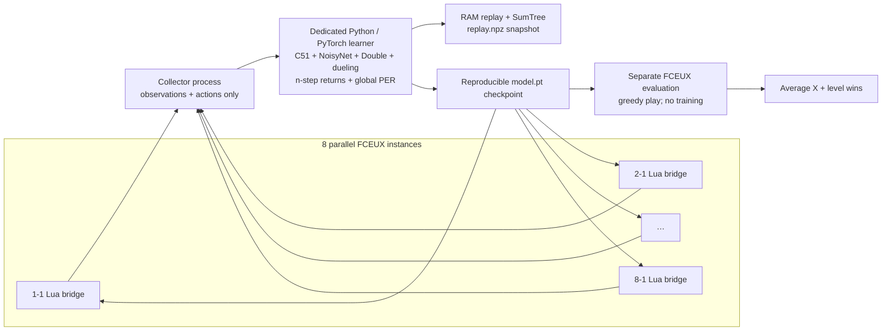
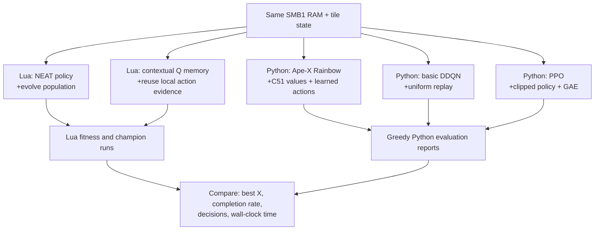
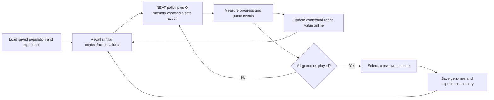
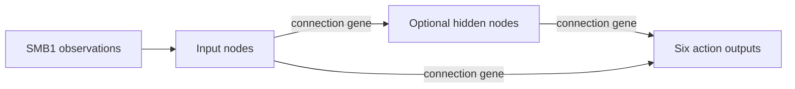
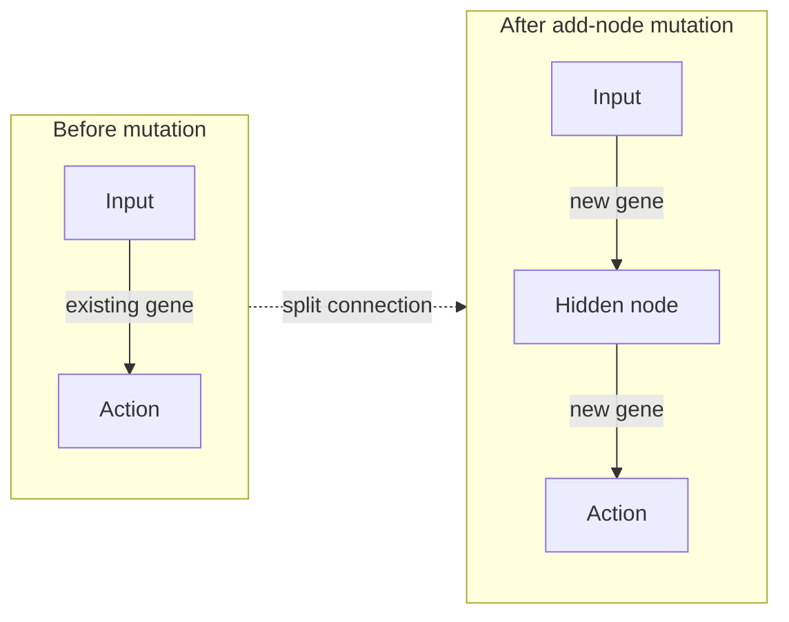
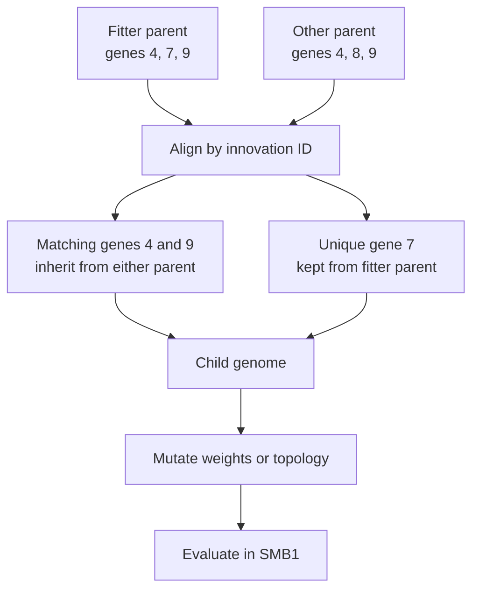

# Mario AI NEAT

[](https://github.com/heaven-hm/super-mario-ai/actions/workflows/python.yml)

An AI that learns to play **Super Mario Bros. 1 for NES in FCEUX**. It uses NEAT to evolve a neural network that chooses Mario's actions over repeated attempts.

> **Project scope:** SMB1 for NES, in FCEUX. The AI is based on SethBling's MarI/O learning approach for Super Mario World, adapted for this game and emulator.

## See it in action


*A World 1-1 training run in FCEUX. The overlay shows the current genome, live neural network, selected action, and mini NES controller while Mario remains visible.*

## Benchmark Results: SMB1 World 1-1 (20 episodes, greedy evaluation)

This table compares the four learning methods on the same ROM, level start, and evaluation protocol.
**Note:** Benchmark results table is currently empty. Evaluation runs have not yet been executed per team decision to defer emulation testing (see Issue #3).

| Learning Method | Best X | 1-1 Completion | Mean X | Mean Decisions | Mean Time (s) |
| --- | ---: | ---: | ---: | ---: | ---: |
| Lua NEAT + Q-Memory | — | — | — | — | — |
| Ape-X Rainbow DQN | — | — | — | — | — |
| Basic DDQN | — | — | — | — | — |
| PPO | — | — | — | — | — |

**Legend:**
- **Best X**: Furthest position reached across 20 episodes (pixels)
- **1-1 Completion**: Number of times Mario cleared level 1-1 (out of 20)
- **Mean X**: Average maximum X position per episode
- **Mean Decisions**: Average number of action choices per episode
- **Mean Time**: Average wall-clock seconds per episode (emulation only)

**Evaluation Protocol**: SMB1 title-screen world-selector clean start, seed=2026, 20 deterministic episodes, greedy (no exploration), 12-frame action repeat.

**Best 1-1 Clear**: (GIF/video clip to be added)

## Python parallel training

The original Lua NEAT system remains the FCEUX-native player and
neuroevolution baseline. This branch also has a **Python + PyTorch
Ape-X Rainbow DQN trainer** for faster data collection. It runs eight
isolated FCEUX actors plus a separate evaluation emulator and trains one shared
neural network from their combined experience.

[](docs/images/python-rainbow-eight-workers.mp4)

*Live desktop capture: eight FCEUX training workers play Worlds 1-1 through 8-1 in parallel. The larger **PYTHON EVAL** window at the upper right tests the shared model without random exploration or learning. [Watch the 10-second screen recording](docs/images/python-rainbow-eight-workers.mp4).*

Each training window shows its own **S** (action decisions), **EP** (completed
attempts), **D** (deaths), **V** (wins), **X** (best world position), and **E**
(exploration chance). **U** (model updates) and **M** (stored experiences) come
from the one shared learner. The evaluation window says **PYTHON EVAL** and
shows its own greedy attempts; its **E** is zero. These counters show activity,
while evaluation distance and wins measure whether play improves.



The Lua bridge only reads SMB1 RAM, draws the FCEUX HUD, and presses NES
buttons. The Python collector exchanges observations and actions; a separate
Python learner owns action scoring, replay, optimization, and checkpointing.
Every worker has a different course start: **1-1, 2-1, 3-1, 4-1, 5-1, 6-1,
7-1, and 8-1**. World, level, and area values are part of each observation so
the shared model can distinguish those courses.

### Why this project tests NEAT and Q-learning

The project intentionally keeps two independent learning paths. They learn
from the same SMB1 RAM and tile observations, but their learning mechanisms
are different. Keeping both lets us measure progress with the same ROM, level
start, and FCEUX setup instead of assuming one approach is better.

| Path | Runtime and framework | What is learned | Why it is here |
| --- | --- | --- | --- |
| **Lua NEAT + contextual Q-learning** | FCEUX Lua; custom NEAT implementation and a bounded Q-value memory in `mario_ai_neat.db` | NEAT evolves neural-network topology and connection weights. Its small Q-learning memory records action values for similar local situations. | FCEUX-native training, inspectable evolving networks, and a persistent population baseline. |
| **Python Ape-X Rainbow DQN** | Python 3, PyTorch, NumPy, in-memory sum/min-tree PER, FCEUX Lua bridge | C51, learner-side NoisyNet, Double DQN, dueling heads, globally proportional PER with global importance-weight normalization, and per-actor n-step returns. Actors use pure epsilon-greedy action selection. | Eight asynchronous FCEUX actors feed one learner in 32-transition batches through a bounded 10,000-batch queue; replay and training run outside SQLite. |
| **Python basic DDQN** | Python 3, PyTorch, bounded in-memory uniform replay, same FCEUX bridge | Double DQN with target network and epsilon-greedy exploration. | A deliberately simpler value-based baseline for measuring Rainbow's added components. |
| **Python PPO** | Python 3, PyTorch, worker-local episode rollouts, same FCEUX bridge | Clipped categorical policy optimization with generalized advantage estimation. | A policy-gradient baseline with the same observations, action set, emulator, and evaluation protocol. |

Here, **Q-learning** means learning an action value: “from this game state,
how useful is each action for future reward?” The Lua system stores a compact
lookup-style Q memory for similar contexts. The Python system uses **Ape-X
Rainbow DQN**: C51 value distributions, learner-side NoisyNet, epsilon-greedy actors, Double DQN,
dueling heads, multi-step returns, and prioritized replay estimate action
values for the 184-feature observation.



NEAT and Rainbow are **not merged into one controller**. Lua NEAT remains a
separate FCEUX player; Python Rainbow is a separate FCEUX player with its own
model checkpoint and in-memory replay snapshots. Keeping separate reports
allows controlled comparisons without mixing their scores.

We created the Python path because Lua NEAT evaluates one genome at a time.
Python can learn from every worker's transition immediately, so an enemy jump
or death provides training signal without waiting for a full 100-genome
generation. The Python implementation is running and tested locally, but it
has not yet demonstrated better gameplay than the mature Lua NEAT database.

Read [Python Rainbow training for FCEUX](docs/python-rainbow.md) for setup,
checkpoint recovery, evaluation, current limitations, and the benchmark protocol.

## SMB1 PPO baseline

A second, independent Python training path exists as an experiment and a
benchmark against the Ape-X Rainbow system: **PPO on a different environment**.
It uses `gym-super-mario-bros` and `nes-py` instead of FCEUX, so it needs no
emulator window, no Lua bridge, and no savestates, and it takes a user-supplied
SMB1 ROM. Rainbow `.pt` checkpoints are not loadable there, because the
observation format, action space, and architecture all differ.

It has its own branch, its own run directory, and its own promotion rule: a
model is only called a World 1-1 solution after a 20-episode deterministic
no-cheat evaluation wins all twenty.

Read [the SMB1 PPO baseline](docs/smb1-ppo.md) for the action mapping, the reward
design and its anti-reward-hacking safeguards, exact commands, hardware
expectations, limitations, and that promotion criterion.


*A live Python worker: the left panel shows RAM and encoder activations; the right panel shows shared replay, update, episode, loss, and action-value telemetry.*


*Ten seconds captured from a live FCEUX training session at Generation 111.*

Click the video thumbnail to watch SethBling's MarI/O video. MarI/O plays Super Mario World; this project targets SMB1 in FCEUX.

[](https://www.youtube.com/watch?v=qv6UVOQ0F44)

## What it does

- Reads Mario, nearby tiles, enemies, and items from SMB1 memory.
- Lua NEAT chooses among six SMB1 actions and evolves how long to hold each
  choice. Python Rainbow chooses among walk/run/jump/retreat actions at learned
  6, 12, or 24-frame horizons, including a backward jump.
- Uses short observation history and event feedback for landings, passing
  enemies, power-ups, and new progress landmarks.
- Keeps a bounded novelty archive so selection preserves some different
  behavior patterns instead of rewarding one repeated route alone.
- Scores each attempt for progress and survival, then evolves the population.
- Saves learning in `mario_ai_neat.db` so later sessions can continue from the saved population.

See [seven complete network diagrams from the database](docs/best-networks.md), drawn from the actual saved connections.

The isolated acceleration experiment has a [technical plan](tasks/plan.md) and a [local FCEUX comparison guide](docs/acceleration-trial.md).

## How this compares with other SMB1 NEAT projects

There is no single winner for every use case. The Python project supports
parallel genome evaluation and reports a 1-1 completion rate; the Lua projects
run inside FCEUX. Mario AI NEAT is specialized for SMB1 in FCEUX, but this
branch's changes have not yet been benchmarked against the other projects.

| Project | Game and runtime | Learning and evaluation | Strongest fit | Trade-off |
| --- | --- | --- | --- | --- |
| **Mario AI NEAT (this branch)** | SMB1 NES, embedded Lua in FCEUX | NEAT with SMB1 RAM/tile features, short history, event rewards, novelty archive, similarity-weighted contextual Q memory, and evolved 1/2/4/6-frame action holds; one genome at a time | Direct SMB1 + FCEUX use, resumable genomes and online action feedback, live HUD | Experimental changes; serial training; no completion-rate comparison yet |
| **Python Ape-X Rainbow FCEUX (this branch)** | SMB1 NES, FCEUX Lua bridge + Python/PyTorch | C51 + NoisyNet + Double + Dueling + n-step + global PER; eight asynchronous actors, separate learner and greedy evaluator | Fast shared data collection across eight repeating World-N-1 → World-N-4 campaigns | Experimental; no controlled completion-rate win over Lua NEAT has been established |
| [MarI/O FCEUX port](https://github.com/juvester/mari-o-fceux/blob/master/neatevolve.lua) | SMB1, Lua in FCEUX | MarI/O-style NEAT, nearby tile/enemy grid, button outputs, fixed savestate, evolution in the emulator | Existing FCEUX Lua baseline and live network display | Smaller game-state feature set; no parallel evaluator |
| [SethBling's MarI/O](https://gist.github.com/SethBling/598639f8d5e8afb5453a0b9519be51ff) | Primarily BizHawk; source handles Super Mario World and SMB1 | NEAT with a 13×13 local grid, button outputs, and species-based evolution | Influential reference implementation | Not an SMB1-only FCEUX project; source asks users not to redistribute it |
| [Vivek's Super Mario NEAT](https://github.com/vivek3141/super-mario-neat) | Python with FCEUX and Python dependencies | NEAT, saved checkpoints, configurable runs, and multiprocessing for parallel genomes | Parallel training workflow; its README reports about 50% completion of 1-1 for the supplied checkpoint | Separate Python setup; reported results are the author's, not a benchmark against this project |

Use this project for a Lua AI running in FCEUX on SMB1. Vivek's project is a
better fit when parallel training and Python tooling matter more. MarI/O is the
historical reference. There is not enough controlled data to say which learns
faster or completes more often.

## Download Pretrained Population

The trained NEAT population and contextual Q-learning experience memory are published as a GitHub Release asset:

- **Download:** [mario_ai_neat.db from Release v1.0](https://github.com/heaven-hm/super-mario-ai/releases/download/v1.0/mario_ai_neat.db) (~1.1 MB)
- **Contents:** 500k+ transitions in Q-memory, evolved NEAT genomes, and evaluation baseline
- **Optional:** Training without a pretrained database is supported; the script creates a new one on first save

To use the pretrained population:
1. Download `mario_ai_neat.db` from the Release link above and place it in the repository root (same folder as `mario_ai_neat.lua`)
2. Open SMB1 in FCEUX
3. Load `mario_ai_neat.lua` from FCEUX's Lua script menu
4. The script automatically finds and loads the adjacent database
5. Set `PLAY_CHAMPION_ONLY = false` to continue training, or `true` to replay the best evolved genome

To start fresh without the pretrained database, simply omit `mario_ai_neat.db`—the script will create a new one on the first save.

## Start playing and training

1. Open a compatible **Super Mario Bros. 1 NES ROM** in FCEUX. The ROM is not included.
2. Keep `mario_ai_neat.lua` and `mario_ai_neat.db` together in one folder.
3. Start the level manually, then load `mario_ai_neat.lua` from FCEUX's Lua script menu. The script finds and loads the adjacent database automatically.
4. For comparable training attempts, Mario must be near the beginning of the level (world X ≤ 128). If loaded mid-level, the AI waits with neutral controls and logs a reset instruction. Reset SMB1 to the beginning; the AI starts once it detects the valid start.

The `.db` file is a learning checkpoint, not a script. Do not load it through the Lua menu. To resume later, load the Lua script again with the same database beside it. Leave `PLAY_CHAMPION_ONLY = false` to continue training.

### Training loop

Each genome plays from the same saved starting point. Training only captures FCEUX slot 9 near the beginning of a level, so every genome gets a comparable attempt. After all genomes have played, the AI uses their results to build the next generation. Exact behavioral duplicates are rejected while breeding, and the highest-scoring policy is carried forward.

The checkpoint preserves episode results, five distinct network genomes, and a persistent **experience memory** shared by every genome. NEAT evolves the neural policy across generations. During each run, a contextual Q-learning table also updates action values from Mario's progress and game events, so feedback can be reused before a full generation finishes. Similar contexts (for example, a Goomba slightly nearer or farther away) share evidence with a lower weight; different hazard classes remain separate. The neural network still scores actions, and the safety filter still blocks disallowed actions.

Experience records are written as optional `X` rows in `mario_ai_neat.db`; new rows include Q values and visit counts, while older V1 rows still load with zero Q evidence. Memory is bounded to 512 contexts. It cannot reconstruct action sequences from old episode summaries or logs that lack action details, and it does not assume a pipe-clearing maneuver is learned until the current script experiences it. Champion Mode remains a direct replay of the archived neural genome for evaluation; contextual experience guidance is used during training.

The design comparison explains why this project uses NEAT plus lightweight online Q memory instead of adding an LLM, MoE, or Transformer to the FCEUX frame loop: [AI architecture research](docs/hybrid-ai-research.md).

Each save also rotates the prior valid checkpoint into `mario_ai_neat.db.bak`. Legacy logs are imported once on the first launch of this version; fields absent from old logs are marked `-1` rather than guessed. An old historical score without its matching genome is preserved separately as score-only and is not treated as a replayable champion. The database still does not contain the FCEUX savestate.



## Resume, start over, or play the champion

### Resume training

The `mario_ai_neat.db` file is a resumable population checkpoint (download from Release v1.0). Keep it beside `mario_ai_neat.lua`, load the SMB1 ROM, then start the Lua script in FCEUX. It automatically loads the population and continues training. The script uses this exact filename; it does not automatically find `mario_ai_heaven_neat.db` or other database names.

If the log says `discarded unsafe training start`, the saved FCEUX slot was too close to a death. The AI leaves that slot, waits for Mario's normal respawn, and records a new start. It does not press Start or score that short failed attempt. If the game remains on a title or game-over screen, start the game manually; the AI never presses Start for you.

To use a checkpoint with a different name, stop the Lua script, back up the checkpoint, and copy it beside the Lua file as `mario_ai_neat.db`. Do not replace the database while the script is running.

### Start a fresh population

Stop the script and move `mario_ai_neat.db` to a backup location. The next launch creates a new population of 300 genomes. Existing databases keep their saved population size.

### Play the best saved genome

Set `PLAY_CHAMPION_ONLY = true` near the top of `mario_ai_neat.lua`, then load the script. It plays the highest-fitness genome in the current population or the archived top-performer list without evolving or restoring slot 9. After touching the flagpole, it releases the controller while SMB1 finishes its normal level transition, then continues in the next level. Set it to `false` and reload to resume training.

## What you'll see and what to expect

Mario AI evolves candidate controllers; it does not understand the game like a person or learn language. Early attempts may die or make little progress. Fitness favors reaching farther, surviving, keeping power-ups, and completing the level. The overlay shows the active genome, input grid, labeled sensors such as enemy DX and speed X, network connections, selected action, pressed buttons, and progress. Click the upper-right corner of the FCEUX screen to hide the overlay, then click **[AI]** there to show it again.

Training time and results depend on the ROM and number of attempts. Fixed level-start evaluations, duplicate-policy filtering, protected top genomes, and explicit episode history reduce wasted comparisons and make progress easier to audit. They cannot guarantee a particular generation count or level completion.

## Technical details

The sections below describe the learning method and implementation. You can use the project without reading them.

### Neural network at a glance

The network receives a fixed SMB1 observation plus delayed changes in its 15
global features. Six outputs score actions; four more choose a hold of 1, 2, 4,
or 6 frames. A close enemy or immediate gap forces an early fresh decision.
Legacy databases keep their original input and action IDs; temporal inputs use
a reserved node range.

```mermaid
flowchart LR
    Observe["Observe SMB1<br/>tiles · Mario · enemies · items"] --> Inputs["215 input values<br/>185 legacy + 30 temporal"]
    Inputs --> Policy["Evolving neural network<br/>nodes + weighted connections"]
    Policy --> Scores["6 action scores<br/>4 action-hold scores"]
    Scores --> Safety["Small safety filter"]
    Safety --> Controls["NES controls<br/>A · B · Left · Right"]
    Controls --> Game["SMB1 in FCEUX"]
    Game --> Fitness["Episode fitness"]
    Fitness --> Evolution["NEAT evolution"]
    Evolution --> Policy
    Evolution <--> Database[("mario_ai_neat.db")]
```



| Network input | Count | Example contents |
| --- | ---: | --- |
| Local tile grid | 169 | 13×13 area around Mario: solid tiles, enemies, and empty space |
| Mario and nearby-object features | 15 | Velocity, grounded state, power, enemy/item distances, gaps, and contact danger |
| Temporal feature changes | 30 | Differences in the 15 global features over 1-frame and 4-frame lags |
| Bias | 1 | Constant input |
| **Total inputs** | **215** | 184 current features, 30 history values, and bias |
| Action outputs | 6 | Run, running jump, retreat, brake, jump in place, controlled walk |
| Action-hold outputs | 4 | Evolved choice of 1, 2, 4, or 6 frames |

The safety filter can block an immediately unsafe choice, such as running into a nearby enemy as small Mario. It leaves the neural network to choose among the remaining actions. Small event rewards provide feedback for safe landings, collected power-ups, passing an enemy, and crossing new 128-pixel landmarks. Progress, survival, power state, death, and level completion remain the main fitness terms. A bounded novelty archive stores six-number behavior summaries in the database and gives modest credit to less common episode outcomes.

### What changes as the AI evolves

A **genome** is one candidate neural-network controller. Nodes represent inputs, optional hidden neurons, and actions. Each connection is stored as a gene with a weight, enabled state, and historical innovation ID.



An add-node mutation splits a connection: the old gene is disabled, a hidden node is inserted, and two new connection genes are added.



After scoring, similar genomes are grouped into species. Parents are chosen within species, matching genes are aligned by innovation ID, and unmatched genes come from the fitter parent. The child is then mutated.



### NEAT mechanisms in this implementation

- **Topology and weight mutation:** add connections, split connections to add nodes, and change weights.
- **Historical markings:** innovation IDs identify corresponding genes during species comparison and crossover.
- **Speciation and fitness sharing:** group related genomes and adjust their selection scores by species size.
- **Crossover:** inherit matching genes from either parent; unmatched genes follow the fitter parent.
- **Elitism and staleness control:** preserve the champion and remove stagnant species after 15 generations unless they contain the champion.
- **Seeded starting behavior:** the first population starts with a small SMB1 movement prior that evolution can change.
- **Temporal context and action timing:** delayed feature differences feed the same feed-forward network, and four evolved outputs select an action hold length. Immediate hazards bypass the hold.
- **Event fitness and novelty:** small event rewards provide earlier feedback, while a persisted bounded archive retains some behavior diversity.

This is a specialized hybrid, not a byte-for-byte implementation of the NEAT paper. NEAT evolves six complete action choices and four action-hold choices. A bounded contextual Q learner adds immediate temporal-difference feedback from progress and events, and a deterministic safety filter masks actions that would make a close threat unavoidable.

### Training speed and limitations

The Lua script evaluates one genome at a time because one embedded FCEUX
process owns one live game state and controller. Parallel evaluation needs a
separate coordinator and isolated savestates; concurrent writes to the same
plain-text database would be unsafe. Vivek's Python project is a useful
parallel-worker reference, but its multiprocessing system is not included in
this single-process Lua trainer. This branch also retains fixed-start training;
curriculum checkpoints need a separate workflow for user-prepared FCEUX states.

Temporal inputs, event rewards, novelty, action holds, and contextual Q memory
are experimental. Similarity-weighted transfer can reuse a learned choice in a
nearby situation, but different geometry or timing may need new experience.
This branch has not yet demonstrated a lower generation count or higher
completion rate, and cannot guarantee a full level in 10 generations. See the
[research comparison and evaluation protocol](docs/hybrid-ai-research.md).

### FCEUX and testing notes

- The Lua script uses FCEUX's embedded Lua runtime and FCEUX APIs. This project currently targets **FCEUX only**.
- Training evaluates one genome at a time; parallel evaluation is not enabled.
- Training uses savestate slot 9 as a shared starting point. Reserve that slot for Mario AI.
- The script supports `savestate.object()` and the older `savestate.create()` API. It does not call `savestate.persist()`.
- Each attempt starts with the in-game timer set to `999`, then the timer counts down normally. The testing aid refreshes lives to `9`; set `TESTING_INFINITE_LIVES = false` for normal lives.
- The AI never starts a game after death. Start the game manually in FCEUX.

### Technology stack

| Part | Technology |
| --- | --- |
| Game | Super Mario Bros. 1 for NES |
| Emulator | FCEUX 2.x |
| Runtime | Embedded Lua 5.1 |
| Learning | NEAT-style neuroevolution with episode fitness |
| Checkpoint | Plain-text `mario_ai_neat.db` |
| Logging | `mario_ai_neat.log` and FCEUX HUD |

No Python process, ML framework, compiler, GPU, cloud service, or network connection is needed while training.

## Sources and attribution

- [MarI/O source by SethBling](https://gist.github.com/d12frosted/7471e2123f10485d96bb) and [the MarI/O video](https://www.youtube.com/watch?v=qv6UVOQ0F44). MarI/O demonstrates NEAT playing Super Mario World; this project adapts the approach to SMB1 on NES in FCEUX. This repository does not redistribute MarI/O source code.
- [MarI/O FCEUX port by juvester](https://github.com/juvester/mari-o-fceux/blob/master/neatevolve.lua), referenced for the FCEUX SMB1 observe/network/controller cycle. The evolved action duration is a separate extension.
- [Vivek's Super Mario NEAT](https://github.com/vivek3141/super-mario-neat), referenced for its documented multiprocessing workflow and SMB1 training results; no Python worker code is included here.
- [Lehman and Stanley, “Abandoning Objectives: Evolution through the Search for Novelty Alone”](https://arxiv.org/abs/1504.04909), referenced for the bounded novelty-archive concept.
- Kenneth O. Stanley and Risto Miikkulainen, [“Evolving Neural Networks through Augmenting Topologies”](https://direct.mit.edu/evco/article/10/2/99/1123/Evolving-Neural-Networks-through-Augmenting), *Evolutionary Computation*, 10(2), 99–127 (2002).
- SMB1 RAM map reference: [Super Mario Bros. disassembly](https://gist.github.com/1wErt3r/4048722). The target RAM layout is not validated for other ROM revisions or hacks.

## Tests and project files

Run the tests with:

```sh
sh tests/run.sh
```

Tests cover network evaluation, enemy sensors and safety, population persistence and evolution, FCEUX compatibility, and controller behavior. Tests do not prove that a trained genome can beat the game.

- `mario_ai_neat.lua` — self-contained SMB1 AI, NEAT trainer, FCEUX loop, and persistence.
- `mario_ai_neat.db` — population checkpoint (download from Release v1.0); keep it beside the Lua file to resume.
- `docs/images/mario-ai-neat-training.png` — main FCEUX screenshot used above.
- `docs/learning.md` — detailed training and persistence notes.
- `docs/limitations.md` and `docs/ram-map.md` — known limitations and SMB1 memory references.
